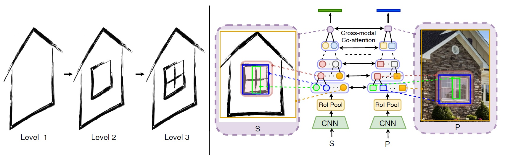
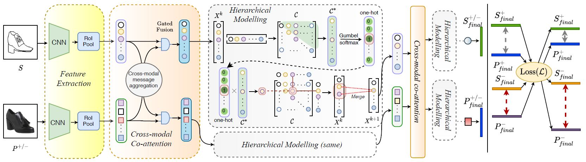
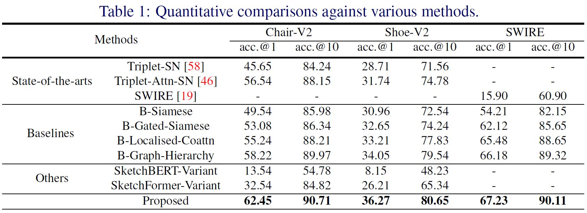
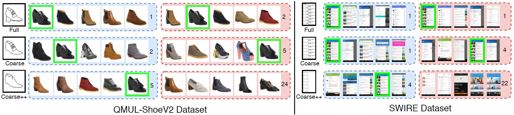

# [Cross-modal Hierarchical Modelling for FGSBIR](https://aneeshan95.github.io/Cross-modal_Hierarchy_FGSBIR/)
#### [Paper](https://arxiv.org/pdf/2007.15103.pdf) accepted for *ORAL* presentation in BMVC 2020. 

# Abstract
Sketch as an image search query is an ideal alternative to text in capturing the finegrained visual details. Prior successes on fine-grained sketch-based image retrieval (FGSBIR) have demonstrated the importance of tackling the unique traits of sketches as opposed to photos, e.g., temporal vs. static, strokes vs. pixels, and abstract vs. pixelperfect. In this paper, we study a further trait of sketches that has been overlooked to date, that is, they are hierarchical in terms of the levels of detail – a person typically sketches up to various extents of detail to depict an object. This hierarchical structure is often visually distinct. In this paper, we design a novel network that is capable of cultivating sketch-specific hierarchies and exploiting them to match sketch with photo at corresponding hierarchical levels. In particular, features from a sketch and a photo are enriched using cross-modal co-attention, coupled with hierarchical node fusion at every level to form a better embedding space to conduct retrieval. Experiments on common benchmarks show our method to outperform state-of-the-arts by a significant margin.

# Illustration

Left half shows different hierarchical levels of detail in a free-hand sketch (illustrative purpose only), while the right half 
illustrates our overall idea of cross-modal hierarchical modelling.

# Framework

 Our framework. After extracting region-wise features from a sketch S) and a photo (P+/−), they are enriched via cross-modal attention,
 followed by hierarchical parsing operation. The last two steps are repeated consecutively, until a final representation from each branch is obtained. 
 A loss (L) brings the matching sketch-photo pair (+) closer (grey) while distancing (red) the unmatched (-) one.

## Implementation
* We use QMUL-ChairV2 and QMUL-ShoeV2 datasets (Available [here](http://sketchx.eecs.qmul.ac.uk/downloads/)) along with an user-interface dataset, SWIRE ([sketches](https://storage.googleapis.com/crowdstf-rico-uiuc-4540/swire_dataset_v0.1/sketches.zip), [images](http://interactionmining.org/rico)).
Please read the [paper](https://arxiv.org/pdf/2007.15103.pdf) for details, and place them in the same way as in code (Screenshot provided).
* A basic version of the algorithm is provided for a clean understanding, along with a few baseline approaches.

# Results



Our method’s (blue) efficiency over a Triplet-loss trained Siamese baseline network (red) at varying extent (coarse, coarse++) of sketch details is shown. Numbers denote rank of the matching photo.

# Citation
If you find this article useful in your research, please consider citing:

```
@inproceedings{sain2020cross,
  title={{Cross-Modal Hierarchical Modelling for Fine-Grained Sketch Based Image Retrieval}},
  author={Sain, Aneeshan and Bhunia, Ayan Kumar and Yang, Yongxin and Xiang, Tao and Song, Yi-Zhe},
  booktitle={BMVC},
  year={2020}
}
```
